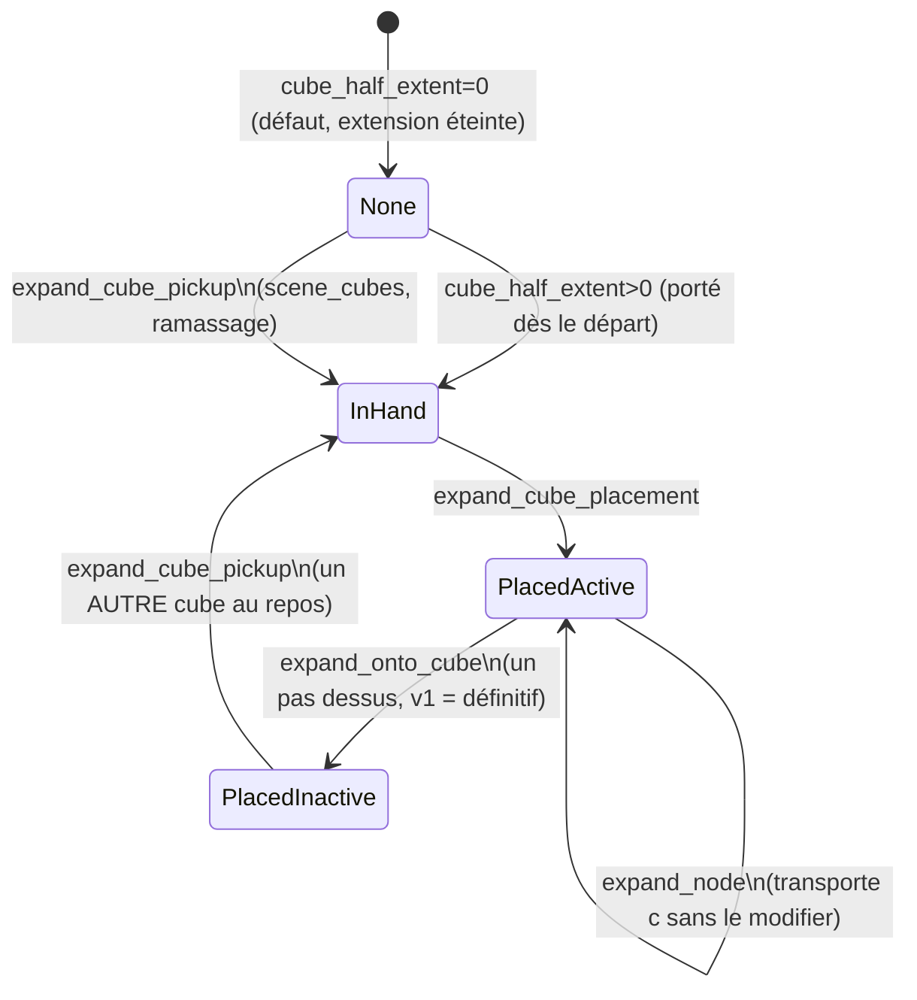

# Comment fonctionne l'extension cube

Suite de `docs/footstep-planning-mechanism.md` (à lire d'abord) — ce document explique comment le
ramassage/la pose/l'enjambement d'un cube s'ajoutent au mécanisme de base, en pointant sur le code.
Le **pourquoi** détaillé (dérivation mathématique, contre-exemple qui a motivé la solution retenue)
est déjà écrit en profondeur dans `docs/cube-extension-spec.md` (pose) et `docs/cube-pickup-spec.md`
(ramassage) — ce document ne le refait pas, il montre comment ça s'assemble avec le reste et où c'est
implémenté.

## Le problème, en une phrase

Le patch d'un nœud est une région (pas un point) — le pied d'appui a plusieurs positions candidates
`x` possibles. Si on traite "poser le cube" comme une action normale (somme de Minkowski du patch
avec un polytope d'atteignabilité du cube, comme un pas ordinaire), on obtient une région de poses
possibles pour le cube, mais **on perd l'association entre CHAQUE pose du cube et le `x` précis qui
l'a produite**. Le pas suivant peut alors sembler atteindre le dessus du cube pour un `x` qui n'a en
réalité jamais permis de poser le cube à cet endroit précis — un faux positif géométrique, démontré
par un contre-exemple 1D dans `cube-extension-spec.md` §2.

**Solution retenue** : tant que le cube est en jeu, un nœud ne porte plus juste `x` (position du
pied) mais un état joint `(x, c)` — `c` = position du cube, transportée et contrainte en même temps
que `x` à chaque étape (`cube-extension-spec.md` §3). C'est ce que `Node::cube`/`CubeState`
implémentent.

## La machine à états : `CubeState`

(`include/nas/core/node.hpp`, enum `CubeState`.) `Node::cube` (`std::optional<CubePlacement>`) porte
`c` — `nullopt` sauf en `PlacedActive` (et transitoirement pendant `InHand`, jamais lu). v1 : un seul
cube à la fois en jeu, utilisé une seule fois (`PlacedActive → PlacedInactive` est définitif — spec
§6, "second usage" explicitement hors scope v1).

## Les trois actions cube, comme sources d'expansion supplémentaires

`AstarSearch::search()` (`src/planners/astar_search.cpp`, boucle principale) appelle `expand_node`
**plus**, selon `current_node->cube_state`, une des trois fonctions suivantes
(`include/nas/core/expansion.hpp`) :

| État courant | Fonction appelée | Effet | Coût (`AstarSearchConfig`) |
|---|---|---|---|
| `None`/`PlacedInactive` | `expand_cube_pickup` | Ramasse un cube au repos dans la scène (`scene_cubes[i]`) si son `pickup_affordance` est satisfaite → `InHand`. Action à déplacement nul (même position/pied/lacet que le parent). | `cube_pickup_cost` |
| `InHand` | `expand_cube_placement` | Pose le cube devant le pied d'appui → `PlacedActive`. Le dessus du cube devient une surface virtuelle pour l'étape suivante. | `cube_place_cost` |
| `PlacedActive` | `expand_onto_cube` | Un pas sur le dessus du cube → `PlacedInactive`. | `cube_step_cost` |

Ces coûts sont séparés de `step_weight` (un pas normal) : l'heuristique ne récompense jamais poser un
cube (il ne déplace pas le pied, donc ne rapproche pas du but au sens EPA — spec §5.4), donc ce sont
les seuls leviers pour préférer/éviter le cube quand un plan existe des deux façons.

### `expand_cube_placement` (`src/core/expansion.cpp`)

Somme de Minkowski **taguée** (`minkowski_sum_tagged`, pas la somme "aveugle" du §2) du patch parent
avec le polytope d'atteignabilité `("Cube", pied_appui, Forward)` — chaque candidat de pose `c` garde
la trace du `x` (`z` dans la notation du spec) qui l'a produit. Découpé par la surface support
**rétrécie de la marge du PIED** (pas une érosion cube-spécifique — approximation v1 délibérément
plus conservatrice, jamais moins, tant que le cube est plus petit que cette marge — voir le
commentaire en tête de la fonction). Le nœud enfant garde `x` (recalculé comme le sous-ensemble du
patch parent réellement couplé à une pose survivante — pas le patch parent recopié tel quel) ET porte
le nouveau `CubePlacement` (`cube.vertices_3d`, sa propre surface virtuelle 2D, `placement_yaw` figé).

### `expand_onto_cube` (`src/core/expansion.cpp`)

Même somme de Minkowski taguée que `expand_node`, mais découpée par le **plan du dessus du cube**
(`cube_height` au-dessus de la base, spec §3.3) plutôt qu'une vraie `Surface`, PLUS la coupe
supplémentaire qui fait toute la différence avec l'approche naïve : classifie chaque candidat sur
`x' − c` (pas sur `x'` seul) contre le carré du cube (`carre_cube`, centré, côté `2×cube_half_extent`)
— exactement la coupe du spec §3.3 qui élimine le faux positif du contre-exemple. `kOnCubeSurfaceId`
(=-2) marque `surface_id` pour distinguer "sur un cube" de "aucune surface" (-1) dans la détection de
cycle.

### `expand_cube_pickup` (`src/planners/astar_search.cpp`, pas `expansion.cpp`)

Volontairement une fonction libre distincte de `core/expansion.*` (voir `cube-pickup-spec.md` §1) :
`SceneCube`/`AstarSearchConfig::scene_cubes` sont un concept de `planners/`, pas de `core/` — un cube
au repos n'est **pas** une `Surface` (jamais injecté dans la scène, jamais vu par la détection de
cycle), juste une région `FootGoal` (même forme que `foot_goals` — voir
`docs/footstep-planning-mechanism.md`) testée à chaque expansion, pas seulement à la terminaison.
1 slot rempli : ce pied seul doit l'atteindre. 2 slots : les 2 DERNIERS pas doivent la satisfaire
ensemble (même appariement nœud+parent que le mode "closing stance" de `foot_goals`). `Node::
cubes_picked_up` (bitmask `uint64_t`, ≤64 cubes) empêche de reramasser le même cube deux fois sur un
même chemin — jamais muté sur le nœud parent, chaque enfant reçoit sa propre copie +1 bit.

## Ce que le pied normal fait quand un cube est actif

`expand_node` lui-même a une branche séparée (`src/core/expansion.cpp`, tout en haut de la fonction,
`if (parent->cube_state == CubeState::PlacedActive)`) : transporte `c` **sans le modifier** à travers
un pas classique (spec §3.2), avec le même mécanisme tagué que `expand_cube_placement`. Chemin
totalement séparé du code non-cube (`cube_state == None`), donc zéro risque de régression pour tout
appelant qui ne touche jamais l'extension — vérifié par la suite de tests existante avant cette
session.

## Configuration

Deux façons d'activer l'extension, indépendantes (`AstarSearchConfig`,
`include/nas/planners/astar_search.hpp`) :

- **`cube_half_extent`/`cube_height`** (>0) : le nœud de départ commence `InHand` — cube porté dès le
  début, jamais posé au repos dans la scène.
- **`scene_cubes`** (non vide, nécessite `cube_half_extent>0`) : le nœud de départ commence `None` —
  mains vides, doit ramasser un des cubes au repos avant de pouvoir le poser/enjamber. Chaque
  `SceneCube` a sa propre `pickup_affordance` (1 ou 2 slots `FootGoal`).

Exclusion validée à la construction : `foot_goals` avec les **2 slots remplis** + `cube_half_extent>0`
lève une erreur (alternance de pied cassée par `expand_cube_placement`, voir
`docs/api-review.md`/le commentaire de `AstarSearchConfig::foot_goals`) — 1 seul slot + cube est
légal depuis l'unification de cette session.

## Index rapide : concept → code

| Concept | Fichier | Fonction/classe |
|---|---|---|
| États du cube | `include/nas/core/node.hpp` | `CubeState`, `CubePlacement` |
| Transport pendant un pas normal | `src/core/expansion.cpp` | `expand_node()`, branche `PlacedActive` |
| Poser | `src/core/expansion.cpp` | `expand_cube_placement()` |
| Enjamber | `src/core/expansion.cpp` | `expand_onto_cube()` |
| Ramasser | `src/planners/astar_search.cpp` | `expand_cube_pickup()` |
| Config carried-from-start | `include/nas/planners/astar_search.hpp` | `cube_half_extent`, `cube_height` |
| Config cubes au repos | `include/nas/planners/astar_search.hpp` | `scene_cubes`, `SceneCube::pickup_affordance` |
| Dérivation mathématique complète | `docs/cube-extension-spec.md` | §2 (piège), §3 (état joint) |
| Spec du ramassage | `docs/cube-pickup-spec.md` | tout le fichier |
| Exemple bout-en-bout | `tests/golden/cube_pickup_and_placement_test.cpp` | `run_cube_pickup_and_placement()` |

## Ce qui manque (catalogue, rien de commencé)

- **Pas de JSON/CLI** pour `cube_half_extent`/`scene_cubes`/`pickup_affordance` — configurable
  seulement en C++ direct aujourd'hui (voir `docs/api-review.md`). `docs/tutorial-running-a-scenario.md`
  pointe vers `cube_pickup_and_placement_test.cpp` comme référence en attendant.
- **Reprendre un cube déjà posé par la recherche** (`PlacedActive → InHand` à nouveau) — hors scope
  v1 explicite (spec §6). Nécessiterait de garder la position de pose après `PlacedInactive`
  (aujourd'hui oubliée, `Node::cube` repasse à `nullopt`) + un couplage tagué supplémentaire.
- **Plusieurs cubes actifs simultanément** (pas juste plusieurs disponibles au repos, un seul ramassé/
  posé à la fois) — jamais retravaillé depuis `cube-extension-spec.md` §6.
- **Cubes de géométries différentes entre eux**, encombrement physique comme obstacle de collision —
  notés hors scope à plusieurs reprises, jamais commencés.
