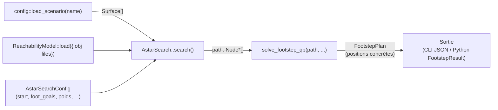

# Comment fonctionne le footstep planning (sans l'extension cube)

Ce document explique le **mécanisme** — comment `AstarSearch` et `solve_footstep_qp` produisent un
plan de pas, en pointant sur les classes/fonctions réelles. `docs/architecture.md` donne la carte du
dépôt (où vivent les fichiers) ; `docs/paper-deltas.md` documente les écarts avec le papier CASSR.
Ce document-ci répond à une question différente : **qu'est-ce qui se passe concrètement quand on
appelle `search()` ?**

L'extension cube (ramassage/pose/enjambement d'un cube) est traitée à part dans
`docs/cube-extension-mechanism.md` — tout ce qui suit décrit le mécanisme de base, cube
désactivé (`cube_half_extent == 0`, `scene_cubes` vide, le cas par défaut).

## Vue d'ensemble

Trois entrées indépendantes (surfaces de la scène, modèle d'atteignabilité, configuration de
recherche) produisent un **chemin de `Node*`** — chaque nœud est une région ("patch"), pas un point.
Le QP choisit ensuite un point concret dans chaque patch. C'est cette distinction patch/point qui
explique la plupart des subtilités plus bas.

## Le modèle de données

- **`Surface`** (`include/nas/core/surface.hpp`) : une zone marchable — sommets 3D/2D, plan, normale,
  centroïde, transforms monde↔surface (`transform_to_3d`/`transform_to_surface`), et
  `polygon_2d`/`vertices_2d` (l'empreinte **déjà rétrécie** de la moitié des dimensions du pied — un
  pas placé sur le bord rétréci a bien tout le pied posé sur la vraie surface).
- **`Node`** (`include/nas/core/node.hpp`) : un pas candidat. Champs clés hors-cube :
  `patch_vertices`/`patch_polygon_2d` (la région atteignable, PAS un point — voir plus bas),
  `centroid`, `stance_foot`, `surface_id` (-1 = nœud de départ), `foot_yaw`/`foot_yaw_bin`, `parent`,
  `g_score`/`h_score`/`f_score`. `NodePool` les possède (un `std::deque`, adresses stables) — jamais
  de `new`/`delete` individuel.
- **`ReachabilityModel`** (`include/nas/core/reachability.hpp`) : une table `(effecteur mobile,
  effecteur d'appui, direction) → polytope` chargée depuis des fichiers `.obj`. `Forward` = "où le
  pied qui bouge peut aller, sachant où est le pied d'appui" (ce que ce document utilise).
  `query()`/`half_space_constraint()` mettent en cache la représentation H (Ax<=b) au premier appel
  (`ReachabilityModel::half_space_constraint`) — coûteux à recalculer, recalculé une seule fois.

## L'étape d'expansion : `expand_node()`

`src/core/expansion.cpp`, fonction `expand_node()` — le cœur de l'algorithme, appelée une fois par
nœud exploré. Ce qui se passe, dans l'ordre :

1. **Interroge le polytope d'atteignabilité** Forward pour `(pied qui va bouger, pied d'appui du
   parent)` (`ReachabilityModel::query`), puis le tourne pour matcher le lacet (`foot_yaw`) et
   l'inclinaison de la surface du parent (`rotate_polyhedron`/`rotate_polyhedron_z`,
   `foot_frame_rotation` — l'équation 2 du papier).
2. **Somme de Minkowski** du patch **entier** du parent (`parent->patch_vertices`, pas son centroïde
   seul !) avec ce polytope tourné (`minkowski_sum`) → une région 3D `P_union`, "partout où le
   nouveau pied pourrait être, depuis n'importe quel point déjà atteignable par le parent".
3. **Pour chaque surface de la scène** : découpe `P_union` par le plan de la surface
   (`compute_polytope_plane_intersection`), projette en 2D, découpe par l'empreinte rétrécie de la
   surface (`compute_2d_polygon_intersection`), reconvertit en enveloppe convexe nettoyée
   (`clean_polygon` — supprime les sommets quasi-colinéaires, démarre à un sommet canonique : sans
   ça, le bruit flottant du tas changerait le résultat d'une exécution à l'autre).
4. **Détection de cycle** (`cycle_path_detection`) : refuse de reposer le même pied sur une surface
   déjà quittée par ce pied sur ce chemin (Sec. IV du papier).
5. **Éventail de lacet** (`candidate_yaws`, si `rotation_enabled`) : `2×yaw_discretization_num+1`
   candidats de lacet autour de celui du parent, chacun devenant un nœud enfant séparé.

**Point important, qui explique beaucoup de comportements en aval : le "patch" d'un nœud est une
RÉGION qui s'accumule le long du chemin, pas un point.** Sur un sol ouvert et plat (aucune surface ne
vient le rogner), le patch peut rester très grand — plusieurs mètres — sur toute la longueur d'une
recherche : la somme de Minkowski d'un grand patch reste grande. C'est voulu par l'algorithme
(le patch encode "tout ce qui est encore possible"), pas un artefact.

## La recherche A* : `AstarSearch`

`include/nas/planners/astar_search.hpp` + `src/planners/astar_search.cpp`. Un A* pondéré classique
(`f = g + heuristic_weight × h`), avec deux mécanismes propres à ce planificateur :

### Le but : `AstarSearchConfig::foot_goals`

Un but par pied (`std::array<std::optional<FootGoal>, 2>`, indexé par `StanceFoot`), au moins un slot
rempli. `FootGoal::region` est un de ces trois variants :
- `Point_3` — un point précis.
- `int` — une surface entière (n'importe où dessus ; test d'**égalité d'indice**
  `node.surface_id == id`, pas de géométrie).
- `std::vector<Point_3>` — un polytope arbitraire (≥3 sommets).

Plus, optionnellement, `yaw_range` (une plage de lacet acceptée). Trois cas :
- **1 slot rempli** : ce pied doit satisfaire son slot (`foot_goal_satisfied` — containment
  géométrique pour point/polytope, égalité d'indice pour surface), l'autre pied reste libre.
- **2 slots remplis** ("closing stance") : termine seulement quand les 2 DERNIERS pas consécutifs
  (un par pied) satisfont chacun leur propre slot **en même temps** — l'heuristique doit alors sommer
  la distance restante des DEUX pieds (`AstarSearch::search()`, le terme `current_own_term`), sinon
  la recherche peut faire converger un pied sans jamais tirer l'autre vers le sien.

`goal_yaw_weight` (biais souple, optionnel) ajoute un coût qui tire tout le chemin vers le centre du
`yaw_range` du slot ciblé (pas juste un filtre à l'arrivée) — seulement valable à 1 slot rempli.

### Déduplication : `PatchIndex`

Deux nœuds sont "le même" (seul le meilleur est gardé) s'ils partagent surface, pied, case de lacet
(`foot_yaw_bin`) et que leurs patchs sont à moins de `node_similarity_threshold` (2cm par défaut) l'un
de l'autre. `PatchIndex` (classe anonyme en tête de `astar_search.cpp`) est un hash spatial sur le
centroïde (case de côté `patch_index_cell_size`, 5cm par défaut) pour éviter de comparer chaque
nouveau nœud à tous les nœuds déjà vus — voir `docs/patchindex-scalability-note.md` pour l'histoire
complète de ce mécanisme (bug de troncature du lacet, taille de case).

### L'heuristique

`heuristic_weight × distance(patch_du_nœud, but)` — distance EPA (COAL) entre polytopes par défaut,
ou distance euclidienne (centroïde à centroïde) si `distance_metric = Euclidean`. Coûts optionnels
additionnels sur une arête : `yaw_change_weight` (pénalise tourner), `heading_weight` (favorise
s'aligner avec la direction du but), `goal_yaw_weight` (voir ci-dessus).

## Le QP : `solve_footstep_qp`

`include/nas/footstep_qp/footstep_qp.hpp` + `src/footstep_qp/footstep_qp.cpp`. La recherche a produit
une **séquence de patchs** ; le QP choisit un **point concret** dans chacun. Variables : une position
3D par nœud du chemin + une marge scalaire `alpha`.

**Objectif exact** (`footstep_qp.cpp`, commentaire en tête de `solve_footstep_qp`) :
`minimiser Σ‖stride_i‖² − alpha_weight × alpha`, où `stride_1 = x₁−x₀` et `stride_i = xᵢ−x_{i−2}` pour
`i≥2` (foulée = distance entre deux pas du MÊME pied, Eq. 6 du papier). `alpha` est margé contre les
contraintes d'atteignabilité (H-rep mis en cache de `ReachabilityModel`) — maximiser `alpha` pousse la
solution loin du bord des polytopes, pas juste faisable de justesse.

**Contraintes**, par pas : rester dans le patch (surface + polygone rétréci), rester dans le polytope
d'atteignabilité tourné (par rapport au pas précédent), position de départ fixée. Le **but** :
- Un point (`goal_position` a une valeur) : dernier pas fixé à ce point (égalité).
- Rien (`std::nullopt` — cas surface/polytope/2-slots) : dernier pas libre sur son propre patch, même
  contrainte que les pas intermédiaires — **aucune incitation à s'y déplacer plus qu'ailleurs**, voir
  `docs/api-review.md` pour pourquoi ça peut donner un résultat surprenant sur un sol très ouvert.

Le Hessien de l'objectif est seulement semi-défini positif (noyau : translater tous les pas de la même
constante) — `hessian_regularization` (Tikhonov, 1e-8 par défaut) le rend inversible pour le solveur
actif-set d'eiquadprog, sans changer l'optimum du problème contraint.

## Index rapide : concept → code

| Concept | Fichier | Fonction/classe |
|---|---|---|
| Charger une scène nommée | `include/nas/config/scenario.hpp` | `load_scenario()` |
| Charger un modèle d'atteignabilité | `include/nas/core/reachability.hpp` | `ReachabilityModel::load()` |
| Un pas candidat (région, pas point) | `include/nas/core/node.hpp` | `Node` |
| L'étape d'expansion (Minkowski + clip) | `src/core/expansion.cpp` | `expand_node()` |
| La recherche A* | `include/nas/planners/astar_search.hpp` | `AstarSearch::search()` |
| Le but (point/surface/polytope, 1/2 pieds) | `include/nas/planners/astar_search.hpp` | `AstarSearchConfig::foot_goals`, `FootGoal` |
| Dédoublonnage des nœuds | `src/planners/astar_search.cpp` | `PatchIndex` (namespace anonyme) |
| Choisir un point concret par pas | `src/footstep_qp/footstep_qp.cpp` | `solve_footstep_qp()` |
| Charger tout depuis un JSON | `include/nas/config/planner_config.hpp` | `load_planner_config()`, `resolve_goal()` |

Voir `docs/tutorial-running-a-scenario.md` pour lancer concrètement un scénario, et
`docs/api-review.md` pour une évaluation de l'API/du fonctionnement actuels.
